==================================================

.. contents:: Table of Contents


Objective
####################
Use this guide and the provided sample app & tools to explore the Web App & API Protection (WAAP) capabilities of the F5 Distributed Cloud platform (xC). This will help you get started with several WAAP use-cases: 

- Web App Firewall (WAF)
- API Discovery & Protection
- Load Balancer Service Policies
- Bot mitigation
- DoS/DDoS mitigation

The guide provides two paths for setting up the baseline demo environments and configuration of xC during the demo:

- *PATH 1: Manual configuration* via the web-based Distributed Cloud Console
- *PATH 2: Automated configuration* via included  `Ansible scripts <./ansible/README.md>`_
  
Scenario
####################
We’ll use a representative customer app scenario: a Star Ratings application which collects user ratings and reviews/comments on various items (eCommerce, customer service use-cases, etc.). This app is running on Kubernetes, and can be deployed on any cloud, but for the purposes of the demo guide we will deploy it on xC virtual Kubernetes (vK8s) and protect it with xC WAAP.

Scenario Architecture
#######################
The xC WAAP is a set of managed security services which provides a holistic set of protection for distributed app services. In our scenario the app services are deployed across multiple vK8s pods in different xC vK8s regions served by F5 Global PoPs in order to represent a distributed workload; the same model would apply to any similar deployment on any cloud(s).

The demo is intended to be self-sufficient as a quick way to onramp onto xC platform with a typical sample app deployed in a docker container, and managed via xC services. A separate custom-built "utility" tools service is also included, which provides the tooling that generates simulated user traffic as well as attacks (such as WAF or Bot) to help illustrate different WAAP use-cases. 

*App docker container*: contains the Start Ratings app that consists of a simple backend service that exposes and API, and a front-end that consumes the API. 

*Tools service*: contains scripts & utilities in a simple web-based service that will accept a URL only for the Star Ratings sample app (i.e. not another app/website), and can be used to stop/start user & attack traffic, stop/start bot attacks, etc. In the scope of this guide is to create an HTTP load balancer without a domain nam, however, should you want to use a domain and HTTPS you can do so by choosing an HTTPS load balancer instead of HTTP and then use auto-cert/attach your own certificate and point domain name to the load balancer in the steps below.

.. figure:: assets/waap_overview.png


Pre-requisites
#################

- F5 Distributed Cloud Account (trial is sufficient for this demo guide)

*PATH 1: Manual Configuration* 

- A Web browser to acces the F5 Distributed Cloud console
- The command-line interface (cli) Kubernetes management tool: `kubectl <https://kubernetes.io/docs/tasks/tools/#kubectl>`_

*PATH 2: Automated Configuration*
- Linux-based system (or on Windows run the Subsystem For Linux) with configured Ansible binaries
- Follow the `Ansible section <#path-2-automated-config-of-the-demo-environment-configuration-via-ansible>`_ of the guide 

PATH 1: Manual Config of the Demo Environment Configuration via xC Console
###########################################################################

In order to deploy the sample application, we first need to create a Virtual kubernetes cluster within xC. Once created, we will set up and configure an HTTP load balancer with pool and origin server configuration. Follow the below steps to set up vK8s & then the HTTP Load Balancer.

Create Virtual Kubernetes (vK8s) cluster
*****************************************

Once logged in the F5 Distributed Cloud Console, navigate to **Distributed Apps**:

.. figure:: assets/home_dist_apps.png

Then proceed to **Virtual K8s** and click the **Add Virtual K8s** button. This will open the creation form. 

.. figure:: assets/vk8s_create.png

Now let's fill in the form. First, give the vK8s a name.

.. figure:: assets/vk8s_cluster_name.png

And then click the **Select Vsite Ref** button to assign Virtual Sites. Vsite Ref is the virtual-site reference of locations on the F5 Global Network where vK8s will be instantiated. 

.. figure:: assets/vk8s_cluster_vsite_ref.png

Check the default virtual site for our vK8s - **ves-io-all-res**. It covers all regional edge sites across F5 Application Delivery Network (ADN).  

.. figure:: assets/vk8s_cluster_vsite_selected.png

And then click **Save and Exit** to complete creating the vK8s cluster in all F5 Distributed Cloud Regional Edge (RE) sites.

.. figure:: assets/vk8s_save_and_exit.png

The process of creating a vK8s cluster takes just a minute, and after that you will be all set to deploy and distribute app workloads onto this new Kubernetes infrastructure. There are two ways to deploy into F5 Distributed Cloud services: using the User Interface (UI) with F5 Distributed Cloud Console or with a Command Line Interface (CLI) via Kubectl. In this guide we will use **Kubectl**.

First, we will need a kubeconfig file for our cluster. Kubeconfig stores information about clusters, users, namespaces, and authentication mechanisms. To get the Kubeconfig, open the drop-down menu and select **Kubeconfig** to download it.     

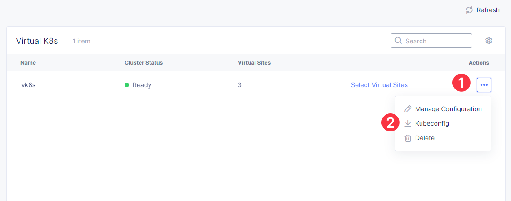

The Kubeconfig will be downloaded with the default certificate expiration date. Select date and press **Download Credential**.

.. figure:: assets/vk8s_kubeconfig_download.png
   :width: 500px

For the next step you need to have the `kubectl tool <https://kubernetes.io/docs/tasks/tools/#kubectl>`_.

In your client environemtn, open the command line interface (cli) and run the **kubectl** tool to execute a command to deploy the sample app. Type the path to the downloaded credentials file for the kubeconfig parameter. **vk8s-manifest.yaml** you can find in this project repository.

```
kubectl --kubeconfig {{ path to the credentials file  }} apply -f vk8s-manifest.yaml
```

.. figure:: assets/vk8s_deploy.png
   :width: 600px


Set up the HTTP Load Balancer
******************************

Next, we will need to make our sample app workload accessible by configuring HTTP Load Balancing settings for our app. We will create an origin pool for the services. Origin pools consist of endpoints and clusters, as well as routes and advertising policies that are required to make the application available to the internet.

Back in the F5 Distributed Cloud Console navigate to  the **Load Balancers** service in the service menu. 

.. figure:: assets/load_balancer_navigate.png
   :width: 600px

Select **HTTP Load Balancers**.

.. figure:: assets/load_balancer_navigate_menu.png
   :width: 500px

Click the **Add HTTP Load Balancer** button to open the form of HTTP Load Balancer creation.

.. figure:: assets/load_balancer_create_click.png
   :width: 600px

Then enter a name for the load balancer.

.. figure:: assets/httplb_set_name.png

Next we need to provide a domain name for our workload: a domain can be delegated to F5, so that Domain Name Service (DNS) entries can be created quickly in order to deploy and route traffic to our workload within seconds. In this demo we specify **star-ratings.example.com**.

If you delegated zone to XC, you can use "auto DNS manage by XC". 


After that let's create a new origin pool, which will be used in our load balancer. The origin pools are a mechanism to configure a set of endpoints grouped together into a resource pool that is used in the load balancer configuration. Click **Add Item** to open the pool creation form.

.. figure:: assets/httplb_pool_add.png

Then open the drop-down menu and click **Create new Origin Pool**.

.. figure:: assets/httplb_pool_add_create.png

To configure the origin pool we'll add a pool name, followed by a set of config options for the pool. First, let's give this pool a name. 

.. figure:: assets/httplb_pool_name.png

Now click **Add Item** to start configuring an origin server.

.. figure:: assets/httplb_pool_origin_add.png

Let's now configure origin server. First open the drop-down menu to specify the type of origin server. For this demo select **K8s Service Name of Origin Server on given Sites**. 
Then specify service name indicating the service we deployed in the corresponding namespace. Please note that it follows the format of **servicename.namespace**. We use **star-ratings-app.github** for this demo.
After that we need to select the **Virtual Site** type and select **shared/ves-io-all-res**. 
Finally, the last step to configure the origin server is specifying network on the site. Select **vK8s Network on Site**.
Complete by clicking **Add Item**.

.. figure:: assets/httplb_pool_origin_configure.png

Next we need to configure the port (the end point service/workload available on this port). In this demo it's Port **8080**.

.. figure:: assets/httplb_pool_port.png

Then just click **Continue** to move on.

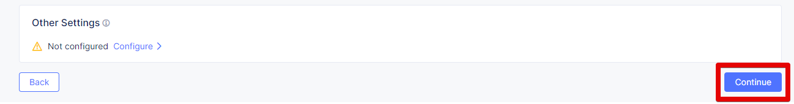

Once done, click **Add Item** to apply the origin pool to the load balancer configuration. This will return to the load balancer configuration form.

.. figure:: assets/httplb_pool_confirm.png

Take a look at the load balancer configuration and finish creating it by clicking **Save and Exit**.

.. figure:: assets/httplb_save_and_exit.png

We will need a CNAME record in order to generate traffic and to run attacks on our app. For the purposes of this guide, you can use the generated CNAME value as shown in the image below. However, should you want to use your own domain, you can; there are several ways that you can delegate your DNS domain to F5 Distributed Cloud Services. A reference on how to do so is here:  `Domain Delegation <https://docs.cloud.f5.com/docs/how-to/app-networking/domain-delegation>`_.


Now let's open the website to see if it's working. You can use CNAME or your domain name to do that.

.. figure:: assets/website.png

Great, your sample app should be live and you should be ready to go through the WAAP use-cases.

PATH 2: Automated Config of the Demo Environment Configuration via Ansible
#############################################################################

Follow the `README <./ansible/README.md>`_ to configure the Ansible environment. You will need to configure the required Ansible Galaxy collections, tokens, and also update the *playbook.yaml* section in the beginning of the playbook that captures xC environment settings.

Once configured, we recommend you review *playbook.yaml* sections, and pick those you'd like to run (such as environment setup), and comment out the rest. Of course, you can choose to run the entire playbook -- that will go through and do all of the setup & demo config steps automatically from beginning to end. 

Thus, we suggest you comment out the *WAAP use-case demo steps* section and those that follow in the *playbook*, and then decide if you want to run through the WAAP use-cases below manually, or use Ansible to do the config by uncommenting the relevant sections. 


WAAP Use-Case Demos
####################

At this point, whether you used the manual approach in *PATH 1* or Ansible automation in *PATH 2*, you should have a working sample app. You can now start running through the WAAP use-cases. Again, you can follow the steps below to proceed with the use-cases manually, or you may choose to use corresponding sections in the Ansible guide to automate what's done manually. 

APP Protection
**************

A skilled attacker will use automation and multiple tools to explore various attack vectors. From simple Cross-Site Scripting (XSS) that leads to website defacement to more complex zero-day vulnerabilities, the range of attacks continues to expand and there isn’t always a signature to match!

The combination of signatures, threat intelligence, behavioral analysis, and machine learning capabilities built into F5 Distributed Cloud WAF enables detection of known attacks and mitigation of emerging threats from potentially malicious users. This provides effective and easy-to-operate security for apps delivered across clouds and architectures.

In the **App Protection** use-case we will see how easy it is to create an effective WAF policy using F5’s Distributed Cloud to quickly secure our application front-end. We already have user traffic of our sample app flowing through the HTTP Load Balancer within F5 Distributed Cloud, routing requests to the app instance(s) running in Amazon AWS. To protect this traffic, we will edit the HTTP Load Balancer we created earlier by configuring App Firewall. 

First, let's test our app and see if it's vulnerable to attacks. For that we are going to use Test Tool which sends attacks to the apps based on its CNAME. 

Follow the link `<https://test-tool.sr.f5-demo.com>`_, then paste the CNAME copied one step before and click **SEND ATTACKS**. In the box under it you will see attack types and site status - our app is vulnerable to them. Now let's go ahead and protect the app by creating and configuring Firewall. Then we will test the app once again to see the result of protection.

.. figure:: assets/test_waf_1.png

Back in the F5 Distributed Cloud Console, open the service menu and navigate to **Web App & API Protection**. 

.. figure:: assets/waf_navigate.png
   :width: 600px

Then proceed to the **HTTP Load Balancers** section.

.. figure:: assets/waf_navigate_menu.png
   :width: 500px

Open HTTP Load Balancer properties and select **Manage Configuration**.

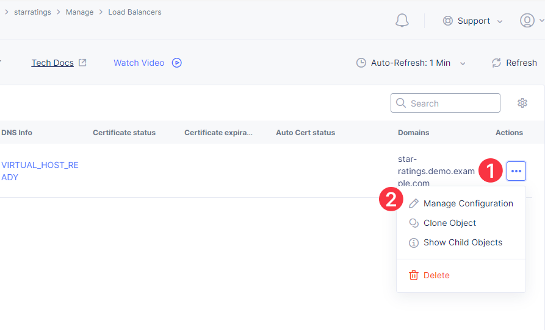

Click **Edit Configuration** in the right top corner to start editing the HTTP load balancer. 

.. figure:: assets/httplb_edit.png

In the **Security Configuration** section first enable **App Firewall** in the drop-down menu, and then click **Create new App Firewall** to configure a new WAF object.

.. figure:: assets/waf_create.png

First, give the Firewall a name.

.. figure:: assets/waf_name.png

Then specify enforcement mode in the dropdown menu. The default is **Monitoring**, meaning that the Distributed Cloud WAF service won't block any traffic but will alert on any request that is found to be violating the WAF policy. **Blocking** mode means that the Distributed Cloud WAF will take mitigation action on offending traffic. Select the **Blocking** mode option.

.. figure:: assets/waf_enforcement_mode.png

Next, we will specify detection settings. Default settings are recommended for mitigating malicious traffic with a low false positive rate. But we will select **Custom** detection settings, in order to override and customize preset policy detection defaults. 

.. figure:: assets/waf_detection_custom.png

Select **Custom** attack type in the drop-down menu and proceed to specifying **Disabled Attack Types**. Select **Command Execution** attack type. Command execution is an attack against web applications that targets Operating System commands to gain access to it. 

.. figure:: assets/waf_attack_types.png

The next property **Signature Selection by Accuracy** allows us to disable some attack types and use different signature sets for optimal accuracy. For this demo let's enable **High, Medium and Low** accuracy signatures.

.. figure:: assets/waf_signature.png

After that we will edit Disabled Violatation list. This enables detection of various violation types like malformed data and illegal filetypes. For this use-case, we will select **Custom** violations, and then specify **Bad HTTP Version**. 

.. figure:: assets/waf_violatations.png

Next we will specify blocking response page. To do that, enable the advanced fields configuration. Then select **Custom** and indicate **403 Forbidden** as response code. By default the Distributed Cloud WAF looks for specific query parameters like "card" or "password" to prevent potentially sensitive information such as account credentials or credit card numbers from appearing in security logs. This can be customized through a Blocking Response Page that can include a custom body in ASCII or base64.

.. figure:: assets/waf_adv_config.png

Now that we’re done with all the settings, just click **Continue**.

.. figure:: assets/waf_continue.png

Click **Save and Exit** to save the HTTP Load Balancer settings.

.. figure:: assets/waf_save_lb.png

Now we are ready to test and see if our app is still vulnerable to the attacks. Follow the link  `<https://test-tool.sr.f5-demo.com>`_, and click **SEND ATTACKS**. In the box under it you will see attack types and their statuses - they are now all blocked and our app is safe. 

.. figure:: assets/test_waf_2.png

Next let’s look at some of the visibility and security insights provided by F5 Distributed Cloud WAAP. Navigate to **Security** and click on our load balancer.

.. figure:: assets/waf_dashboard_navigate.png

Here we will see app dashboard. The dashboard provides detailed info on all the security events, including location, policy rules hit, malicious users, top attack types and other crucial information collected through F5 Distributed Cloud WAAP correlated insights.


Now navigate to **Security Events** and then open one of the security events to drill into it. 


Let’s look at the specifics of the **Java code injection** attack. Here we can not only see its time, origin and src IP, but also drill down to see very detailed information.

.. figure:: assets/waf_request_details.png

After having a look at the attack, it is possible to block the client. To do that, open the menu and select **Add to Blocked Clients**. 

.. figure:: assets/waf_block_options.png

F5 Distributed Cloud WAF provides security through Malicious User Detection as well. Malicious User Detection helps identify and rank suspicious (or potentially malicious) users. Security teams are often burdened with alert fatigue, long investigation times, missed attacks, and false positives. Retrospective security through Malicious User Detection allows security teams to filter noise and to identify actual risks and threats through actionable intelligence, without manual intervention.

WAF rules hit, forbidden access attempts, login failures, request and error rates -- al create a timeline of events that can suggest malicious activity. Users exhibiting suspicious behavior can be automatically blocked, and exceptions can be made through allow lists.

The screenshot below represents how the malicious user can look like.


API Protection 
**************

Protecting API resources is a critical piece of a holistic application security strategy. API Security helps us analyze and baseline normal levels of traffic, response rates, sizes and data being shared via APIs. 

Without API protection all traffic goes directly to the server and can be harmful. Let's take a look at an attack on our sample app and then protect its API.

Go back to the Test Tool  `<https://test-tool.sr.f5-demo.com>`_, and switch to the **API Security in Action** tab. Then click **SEND ATTACKS**. In the box under it you will see the status which shows that API is vulnerable. Now let's go ahead and protect API.

.. figure:: assets/test_api_1.png

Distributed Cloud API Security helps protect API resources based on an Open API specification, typically captured in a Swagger file. The API Security service supports the upload of an Open API specification file, which contains API routes that can be protected by the Web App Firewall, as well as methods that can be enabled and disabled. 

To start API protection configuration, go back to the F5 Distributed Cloud Console, select **Swagger Files** and click **Add Swagger File**. 

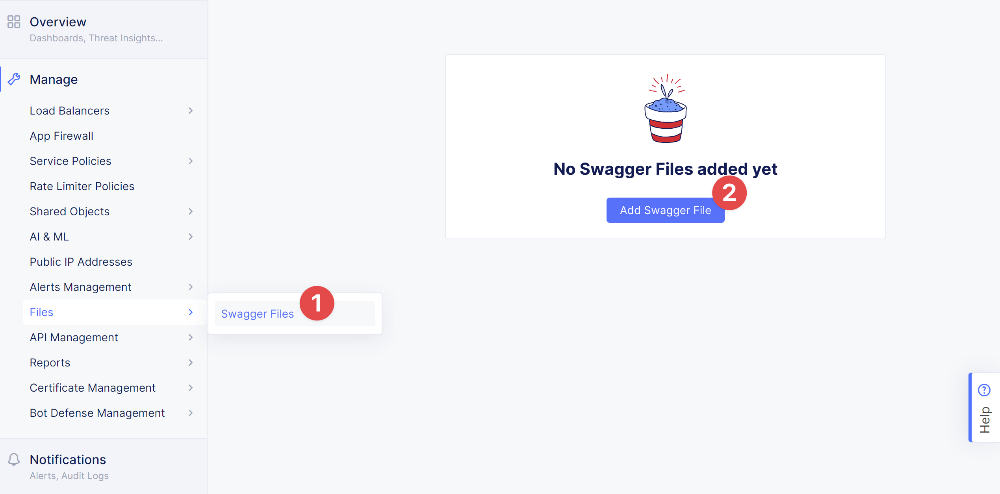

Give swagger file a name and then upload it. Once it's uploaded, click **Save and Exit**.
   
.. figure:: assets/swagger_upload_file.png

Now over to creating API Definition. Navigate to **API Definition** and then click the **Add API Definition** button.

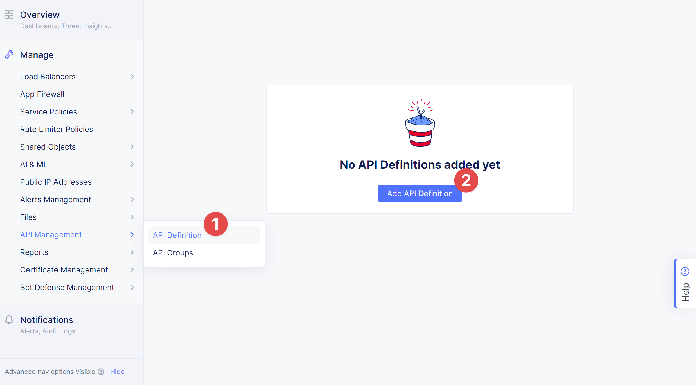

Enter a name in the metadata section. Then go to **Swagger Specs** section and click on the **Enter swagger specs** field. Select the swagger spec added earlier, then click **Save and Exit** to create API definition object.

.. figure:: assets/api_definition_create.png

Now we need to attach the created API definition to our HTTP load balancer. Navigate to **Load Balancers** and select **HTTP Load Balancers**. The HTTP Load Balancer we created earlier will appear. Open its menu and select **Manage Configuration**.

.. figure:: assets/api_definition_lb_popup.png

Click **Edit Configuration** to start editing.

.. figure:: assets/api_definition_lb_edit.png

Go to the **Security Configuration** section and enable the **Show Advanced Fields** option.

.. figure:: assets/api_definition_advanced.png

In the **API Definition** section select **Use API Definition** and then select the API Definition created earlier. 

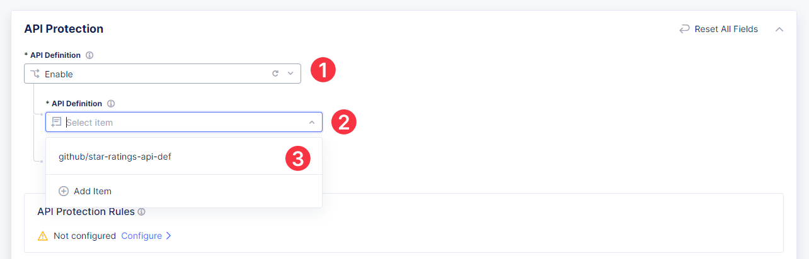

Now we need to a create a new Service Policy with a set of Custom Rules that will specify either an Allow or Deny rule action for specific API resources contained in our Swagger file. This approach uses the combination of Service Policies and Custom Rules to fine-tune and provide granular control over how our application API resources are protected.

Scroll up to the **Service Policies** section and select **Apply Specified Service Policies**. Then click **Configure**. 

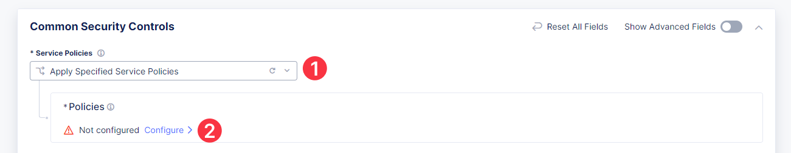

Click on the **Select Service Policy** field and select **Create new Service Policy** option.

.. figure:: assets/api_definition_policy_create.png

Enter a name for the policy in the metadata section and go to the **Rules** section. Select **Custom Rule List** and click **Configure**.

.. figure:: assets/api_definition_policy_create_rules.png

Let's now add rules: click **Add Item**.
   
.. figure:: assets/api_definition_rule_add.png

The first rule will deny all except the API. Enter a name in the metadata section and click **Configure** in the Rule Specification section. 

.. figure:: assets/api_definition_rule_add_details.png

Next configure HTTP Path. Click **Configure** in the **HTTP Path** section.

.. figure:: assets/api_definition_rules_path.png

And fill in the path - **/api/v1/** for this demo. Then click **Apply**.

.. figure:: assets/api_definition_rules_prefix.png

Scroll down to **Advanced Match** section and click **Configure** for the API Group Matcher field.

.. figure:: assets/api_definition_rules_api_matcher.png

Enable **Show Advanced Fields**. In the API Group Matcher screen, select an exact value. 

.. figure:: assets/api_definition_rules_matcher_select_api_def.png

Tick the **Invert String Matcher** option and click **Apply** to add the matcher. 

.. figure:: assets/api_definition_matcher_tick.png

 Click another **Apply** to add the rule specification. 

.. figure:: assets/api_definition_policy_apply.png

Click **Add Item** to add the rule.

.. figure:: assets/api_definition_add_rule.png

Create one more rule to 'allow-other' using the **Add Item** option in the rules section. 

.. figure:: assets/api_definition_second_rule.png

Enter a name in the metadata section and click **Configure** in the Rule Specification section.
   
.. figure:: assets/api_definition_second_rule_details.png

Select **Allow** for Action field in the Action section.

.. figure:: assets/api_definition_second_rule_allow.png

Click **Apply** to add the rule specification.

.. figure:: assets/api_definition_second_rule_apply.png

Click **Add Item** to add the second rule.

.. figure:: assets/api_definition_second_rule_add.png

Take a look at the rules created and click **Apply**. 

.. figure:: assets/api_definition_rule_list_apply.png

Click **Continue** to add the the service policy to the load balancer and then **Apply**.

.. figure:: assets/api_definition_continue.png

.. figure:: assets/api_definition_def_policy_apply.png

The last step is to look the configuration through and save the edited HTTP load balancer. Once you click **Save and Exit** at the end, the Load Balancer will update with the API security settings and our API resources will be protected!

.. figure:: assets/api_definition_lb_save.png

Well done! The API of our sample Rating App is protected based on the spec in the uploaded Swagger file. Let's try and see that the access is forbidden.

Go back to the Test Tool  `<https://test-tool.sr.f5-demo.com>`_, and click **SEND ATTACKS**. In the box under it we will see **protected** status, so our API is safe now.  

.. figure:: assets/test_api_2.png

In cases where API specifications are not known or well documented, the F5 Distributed Cloud API Security provides a machine learning (ML)-based, dynamic API Discovery service.

API Discovery analyzes traffic that flows to and from API endpoints and constructs a visual graph to detail API path relationships. It may be difficult for an organization to keep track of APIs, as they typically change frequently. Over time F5 Distributed Cloud can baseline normal API behavior, usage, and methods, detecting anomalies and helping organization detect shadow APIs that bring unintended risk.

In the screenshot below we can see the percent of requests, learned schema for a specific endpoint, and even download an automatically-generated Swagger file based on discovered APIs.

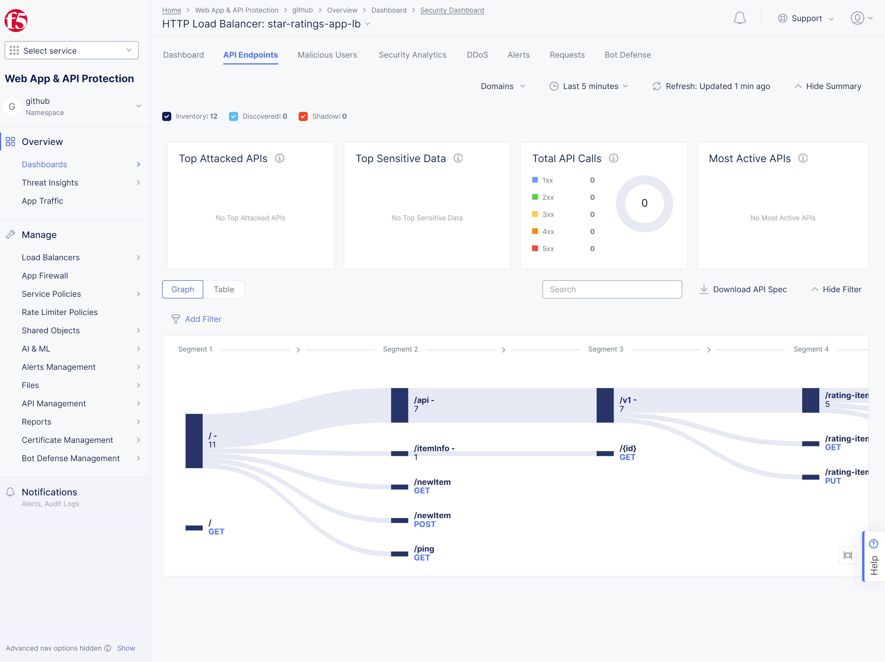

Bot Protection
**************

F5 Distributed Cloud Bot Defense helps us identify attacks and allow us then to easily block them! Our sample rating app could definitely benefit from Distributed Cloud Bot Defense. So let’s see how easy it actually is to set up and use the service!

First let's generate some bot traffic to our app. Go back to the Test Tool  `<https://test-tool.sr.f5-demo.com>`_, and switch to the **Bot Defense in Action** tab. Click **GENERATE BOT TRAFFIC**. In the box under it we will see that all the bot traffic passed. Now let's go ahead and block it by setting up a resilient anti-automation solution that will be attached to the HTTP Load Balancer that processes the traffic to our app. We will then test it to see how Bot Protection works.

.. figure:: assets/test_bot_1.png

Navigate to **HTTP Load Balancers**, open the menu of the load balancer we created earlier and select **Manage Configuration**.

.. figure:: assets/bot_lb_popup.png

Click **Edit Configuration** to start editing the load balancer.


Go to the **Security Configuration** section and enable Bot Defense by selecting **Specify Bot Defense Configuration** in the drop-down menu. The Regional Endpoint is **US** due to its closer proximity to our sample app user base. Click **Configure** to configure Bot Defense Policy.

.. figure:: assets/bot_config.png

Next, we need to configure an App Endpoint, which will contain the policies and actions to protect the specific resource in our app that’s used for adding ratings. To do that click **Configure**.

.. figure:: assets/bot_config_endpoint.png

Click **Add Item** to start adding an endpoint.

.. figure:: assets/bot_config_endpoint_add.png

Name the endpoint and then select HTTP Methods. Let's pick **PUT** and **POST** for this demo. Scroll down and fill in the path - **/api/v1/**.
Then set Bot Traffic Mitigation options to **Block** action for identified bot traffic, and select **403 Forbidden** status. 
Go ahead and click **Add Item** to complete the App Endpoint setup.

.. figure:: assets/bot_full_config.png

We’ve just defined the policy to protect our vulnerable Rating app resource with Bot Defense enabled. Now, click **Apply** to confirm.

.. figure:: assets/bot_endpoint_apply.png

Click **Apply** to apply the configured Bot Defense Policy.


To complete the configuration of load balancer, click **Save and Exit**.

.. figure:: assets/bot_lb_save.png

Now we can test and see the end-result of our setup. Go back to the Test Tool  `<https://test-tool.sr.f5-demo.com>`_, and click **GENERATE BOT TRAFFIC**. This time we will see **blocked** status.  

.. figure:: assets/test_bot_2.png

Now let’s have a look at the Security analytics for the HTTP Load Balancer where we configured Bot Defense. Navigate to **Security** and click on the load balancer name.

.. figure:: assets/bot_dashboard_0.png

Navigate to the **Bot Defense** tab. Here we will see key info breaking down: which bots are making the most malicious requests, which endpoints are attacked the most, and which automation types are being used the most. 

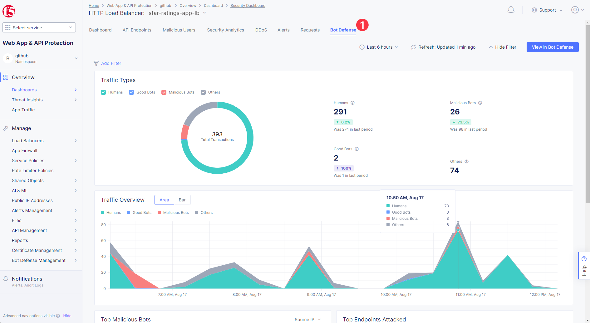

Then move on to the **Bot Traffic Overview** tab. Here we can go into detail on the HTTP Load Balancer traffic from the point of view of Bot traffic analytics. From transactions per minute for a specified timeframe, to detail of every HTTP request with inference of whether it is a legitimate user or automation traffic.

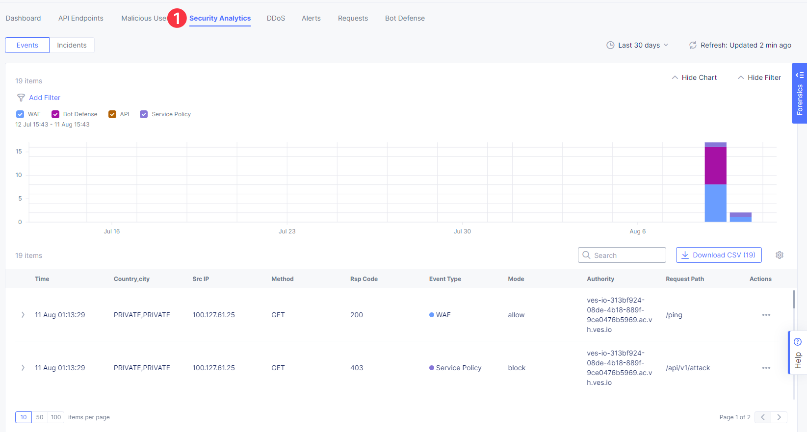


DDoS Protection
***************

F5 Distributed Cloud WAAP is monitoring traffic and is able to identify multiple types of security events, including DDoS attacks directed towards our application as DDoS Security Events. This provides critical intelligence of your app security at your fingertips.

In this demo we will configure DDoS protection by specifying IP Reputation and rate limiting for the sample app. Then we will add DDoS mitigation rule to block users by IP source defining expiration timestamp. 

Navigate to **HTTP Load Balancers**, open the menu of the load balancer we created earlier and select **Manage Configuration**. 


Click **Edit Configuration** to start editing the load balancer.

.. figure:: assets/ddos_lb_edit.png

Enable **IP Reputation** and choose IP threat categories. We select **Spam Sources, Denial of service, Anonymous Proxies, Tor Proxy** and **Botnets** for this demo.

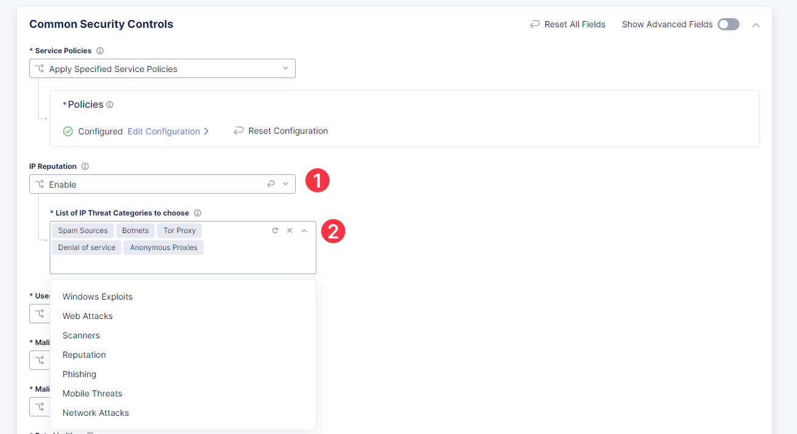

In order to configure rate limiting, select **Custom Rate Limiting Parameters** in the drop-down menu of rate limiting and click **Configure**.

.. figure:: assets/ddos_rate_limiting_select.png

First specify number, then burst multiplier. For this use-case we specify **10** and **5** respectively. Click **Apply** to proceed. 

.. figure:: assets/ddos_rate_limit_config.png

After that select **Single Load Balancer Application** and enable DDoS detection in the drop-down menu.

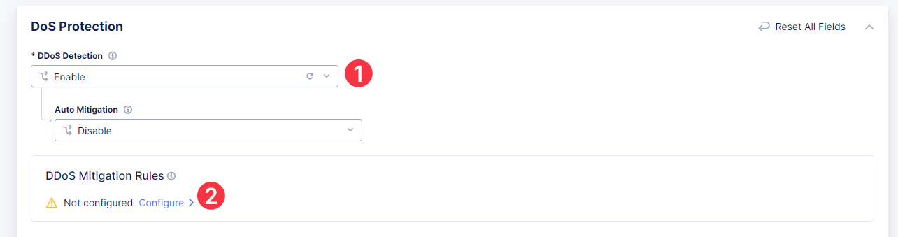

Click **Configure** in the **DDoS Mitigation Rules** section to add a new rule.

.. figure:: assets/ddos_mitigation_select.png

Next click the **Add Item** button to open the form where we will create an ‘IP Source’ mitigation rule.

.. figure:: assets/ddos_mitigation_add.png

Give rule a name, specify IP we want to block - **203.0.113.0/24** and indicate the expiration time stamp. Finally, click the **Add Item** which will create our DDoS Mitigation rule.

.. figure:: assets/ddos_mitigation_rule.png

Click **Apply** to apply the rule we've created.

.. figure:: assets/ddos_mitigation_rule_apply.png

And finally we need to click **Save and Exit** to save these changes and allow the F5 Distributed Cloud WAF engine to start enforcing our newly created DDoS Mitigation rule and blocking the malicious IP.

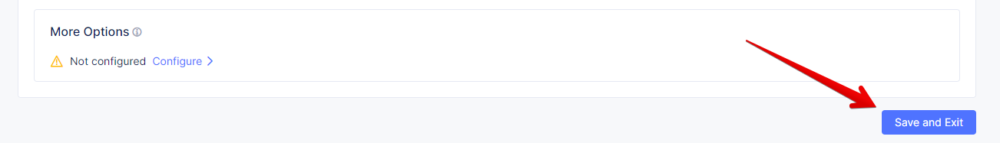

See how easy that was! This should definitely help with the performance and uptime of our application!

We have created the service policy to block that malicious IP. Now let’s have a look at the reporting and analytics for the HTTP Load Balancer where we configured the policy for our app. 

Here we can see all of our app's critical security info in one place. Take a look at the **Security Events** section in the screenshot below showing all the events including the DDoS ones. Notice in the **DDoS Security Events** section we now see blocked traffic from the IP address we specified earlier. We can also see the map of security events giving clear visual security event distribution.

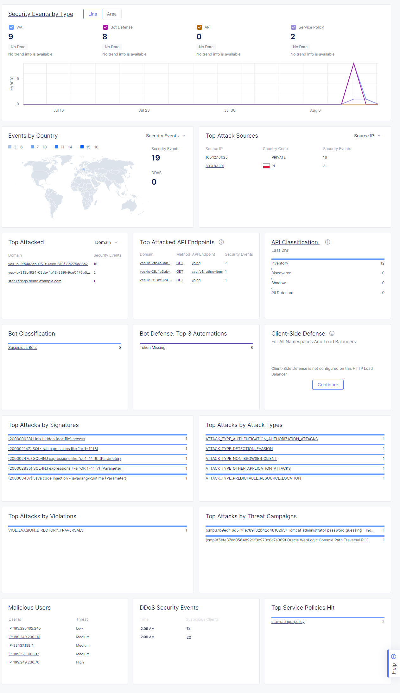

In the screenshot below you can see the analytics for our simulated traffic and attacks. See the impact of attacks on each endpoint by hovering over an endpoint on the map. We can also get insights into Top IPs, Regions, ASNs and TLS FPs. 

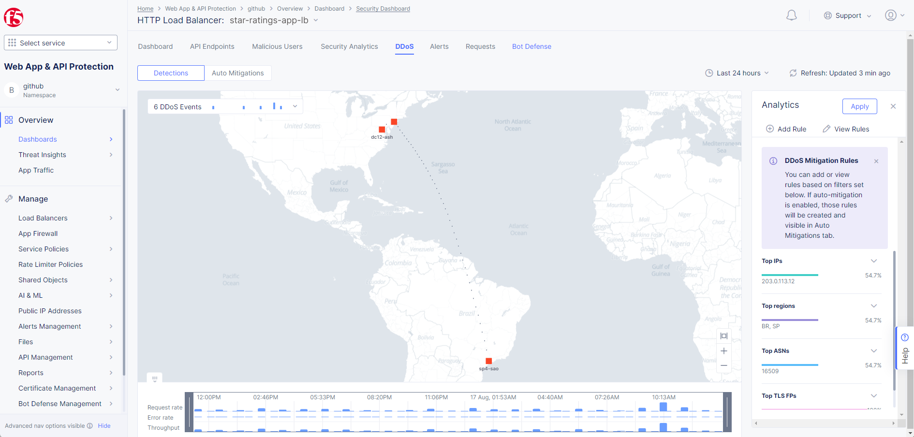

Wrap-Up
#######

At this stage you should have set up a sample app and sent traffic to it. You've configured and applied F5 Distributed Cloud WAAP services in order to protect both the Web & API of the app from malicious actors & bots. We also looked at the telemetry and insights from the data in the various Dashboards & security events.

We hope you have a better understanding of the F5 Distributed Cloud WAAP services and are now ready to implement it for your own organization. Should you have any issues or quesitons, please feel free to raise them via GitHub. Thank you!
